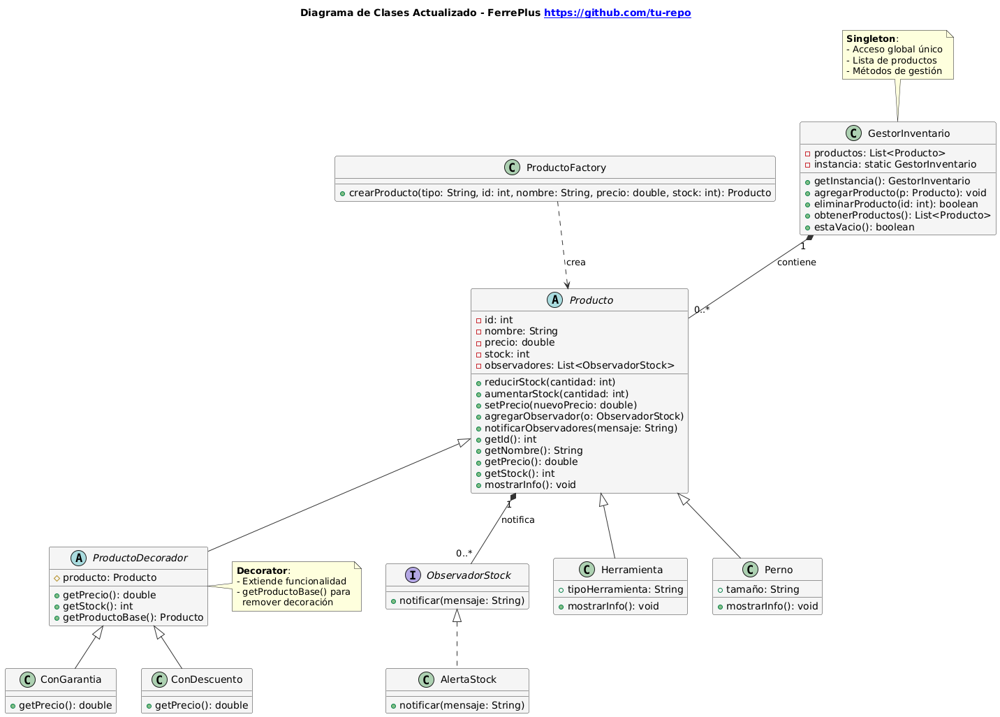
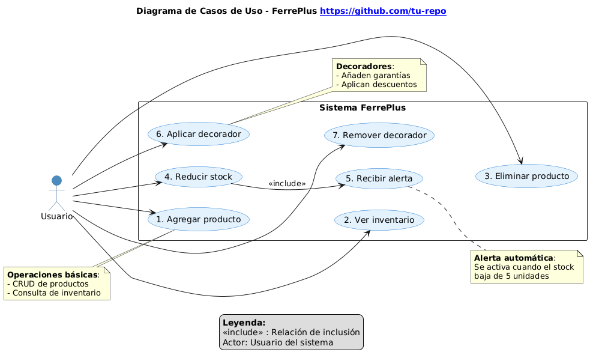
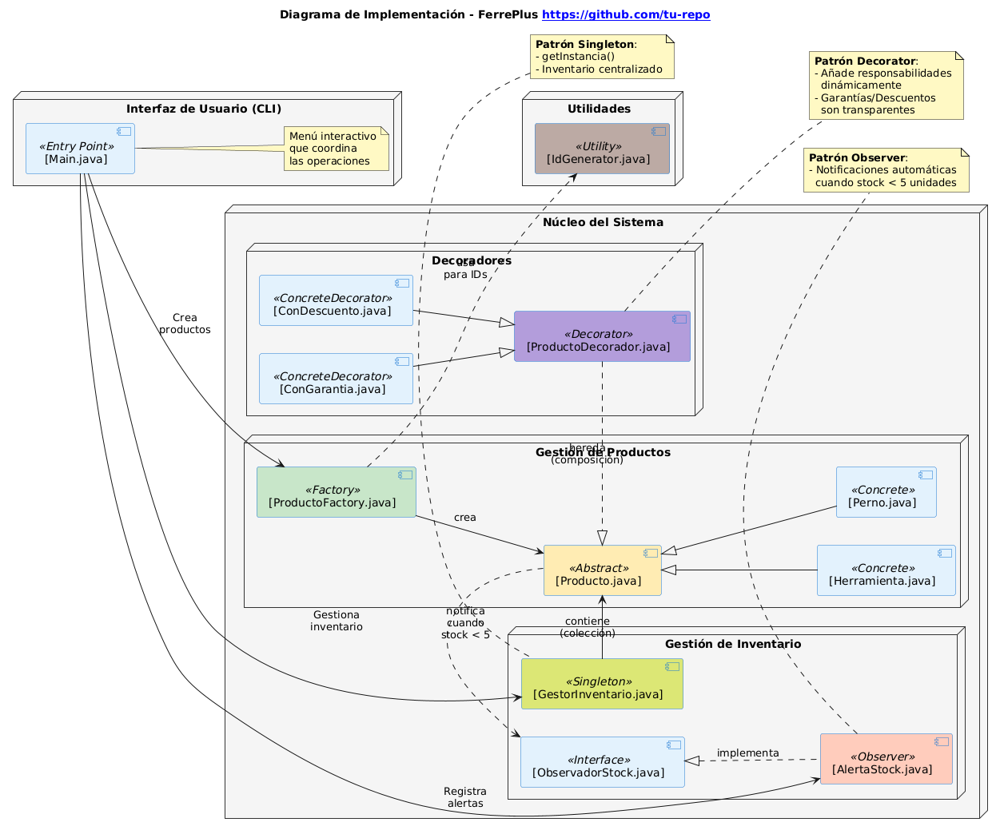

# 🛠️ FerrePlus

**FerrePlus** es una aplicación de consola escrita en Java que simula el sistema de inventario de una ferretería. Permite agregar productos, gestionar stock, aplicar descuentos o garantías, y generar alertas cuando el inventario es bajo. El sistema fue diseñado aplicando 4 patrones de diseño GoF de forma coherente y funcional.

---

## 📌 Problema a Resolver

En una ferretería es común manejar diversos productos (como herramientas y pernos), gestionar inventario dinámico, ofrecer promociones (como descuentos y garantías) y recibir alertas cuando el stock de productos críticos baja. Se requiere una solución organizada, escalable y extensible.

---

## 🎯 Objetivos

- Mantener una lista centralizada de productos.
- Permitir agregar productos de diferentes tipos fácilmente.
- Aplicar funciones adicionales sin modificar las clases base.
- Generar notificaciones automáticamente cuando el stock es bajo.
- Permitir eliminar productos o remover decoradores si ya no son necesarios.
---

## 🧱 Estructura del Proyecto

```

Evaluacion3/
├── img/                   # (capturas o diagramas UML)
├── src/
│   ├── decoradores/       # Patrones Decorator
│   ├── inventario/        # Singleton + Observer
│   ├── productos/         # Producto base y subclases + Factory
│   ├── utilidades/        # Generador de ID
│   └── Main.java          # Menú de interacción
└── README.md

````
---

## 🔧 Funcionalidades Interactivas
Desde el menú de consola se pueden realizar las siguientes acciones:

- Agregar productos (Herramientas o Pernos)
- Visualizar inventario
- Reducir o aumentar stock
- Cambiar precios
- Aplicar o quitar decoradores (garantía, descuento)
- Recibir alertas si el stock es menor a 5
---

## 🧩 Patrones de Diseño Aplicados

### 1. 🔨 Factory Method (Creacional)
**Clase:** `ProductoFactory`  
Permite crear productos (`Herramienta`, `Perno`, etc.) sin depender de sus clases concretas. Facilita la extensión del sistema agregando nuevos tipos de productos con mínimo impacto.

```java
Producto nuevo = ProductoFactory.crearProducto("perno", id, "Perno M8", 300, 50);
````

---

### 2. 🧱 Decorator (Estructural)

**Clases:** `ProductoDecorador`, `ConGarantia`, `ConDescuento`
Permite añadir funcionalidades como garantía extendida o descuento sin alterar la clase original del producto. Cada decorador modifica el comportamiento de `mostrarInfo()`.

```java
Producto decorado = new ConGarantia(productoOriginal);
```

---

### 3. 🔁 Observer (Comportamiento)

**Clases:** `Producto` (sujeto), `AlertaStock` (observador)
El observador AlertaStock se registra manualmente en tiempo de ejecución antes de reducir el stock. Se recomienda agregarlo justo antes de llamar a reducirStock() para que el producto pueda notificar si entra en estado crítico.

```java
producto.agregarObservador(new AlertaStock());
producto.reducirStock(3); // Notifica si stock < 5
```

---

### 4. 👑 Singleton (Libre elección)

**Clase:** `GestorInventario`
Gestiona de forma centralizada la lista de productos. Se garantiza que solo exista una instancia del inventario en toda la aplicación.

```java
GestorInventario inventario = GestorInventario.getInstancia();
```

---

## ⚙️ Instrucciones de Compilación y Ejecución

### Requisitos:

* Java 17 o superior
* IDE como IntelliJ, VS Code o terminal con `javac`

### Paso 1: Compilar

Desde la raíz del proyecto:

```bash
javac -d out src/**/*.java
```

### Paso 2: Ejecutar

```bash
java -cp out Main
```

O desde el IDE ejecuta `Main.java`.

---

## 📸 Diagrama UML

* Diagrama de clases

* Diagrama de casos de uso (presionar para inspeccionar si no se actualiza la imagen)

* Diagrama de implementación

---

## 🙋 Autor

* **Nombre:** Luis Acevedo
* **Asignatura:** Patrones de Diseño
* **Profesor:** Giovanni Cáceres
