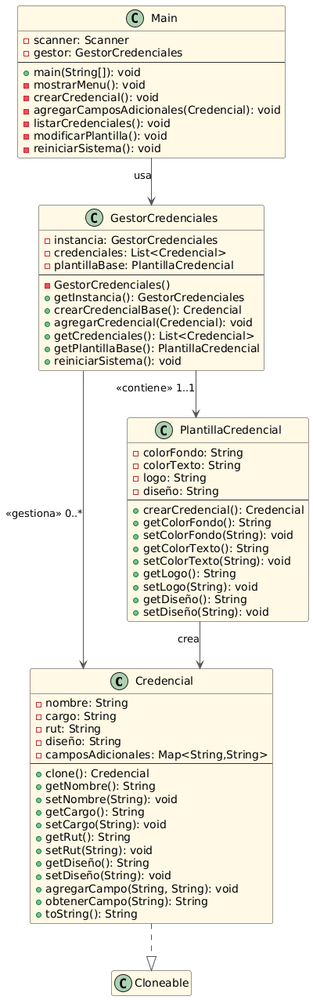

# 🎟️ Informe Técnico: Sistema de Generación de Credenciales para Eventos

**Nombre:** Luis Acevedo, Edison Prado  
**Patrones de Diseño Aplicados:** Prototype y Singleton

---

## 1. Introducción

El sistema permite generar credenciales personalizadas para eventos mediante una plantilla base clonable, garantizando:

- ✔ Consistencia en el diseño mediante **Singleton**
- ✔ Eficiencia en creación de credenciales con **Prototype**
- ✔ Flexibilidad para personalización de campos

---

## 2. Estructura del Sistema

### 📐 Diagrama de Clases (PlantUML)



---

## 📁 Estructura del Proyecto

```
/generador-credenciales
│
├── src/
│   ├── Credencial.java              // Clase con patrón Prototype
│   ├── PlantillaCredencial.java    // Generador base de credenciales
│   ├── GestorCredenciales.java     // Clase Singleton
│   └── Main.java                   // Menú por consola
│
├── README.md                        // Informe técnico
└── diagrama_uml.png              // Diagrama UML en formato PNG
```

---

## 🛠️ Herramientas Utilizadas

- Lenguaje: Java
- IDE recomendado: IntelliJ, Eclipse, VS Code
- Diagrama: PlantUML en Formato PNG

---

## 📄 Licencia

Este proyecto se ha desarrollado con fines académicos para la comprensión y aplicación de patrones de diseño en programación orientada a objetos.


✅ Conclusión
El sistema desarrollado demuestra una aplicación efectiva de los patrones de diseño Prototype y Singleton. Gracias al uso de Prototype, se facilita la creación rápida y eficiente de credenciales personalizadas a partir de una plantilla común. Por otro lado, Singleton asegura el control centralizado y seguro sobre la generación de credenciales, evitando inconsistencias. Esta implementación no solo mejora la escalabilidad y mantenibilidad del software, sino que también fortalece las bases de una arquitectura orientada a objetos limpia y reutilizable.
