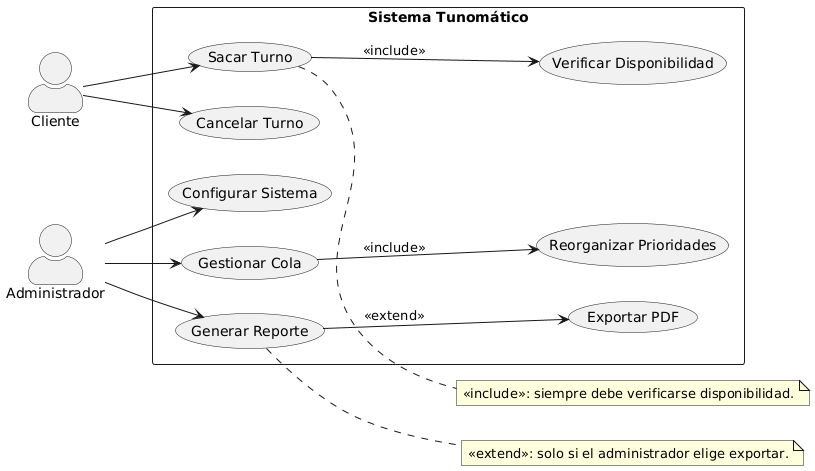
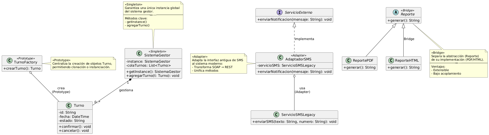
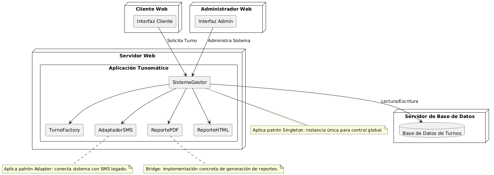

# 🏥 Tunomático - Sistema de Gestión de Turnos Digitales
Nombre: Luis Acevedo Urzúa
## 📌 Descripción General del Sistema
**Tunomático** es un sistema de gestión de turnos digitales diseñado para instituciones médicas que:
- Reduce tiempos de espera en un 40% mediante algoritmos inteligentes
- Soporta un volumen de 500+ turnos diarios
- Integra notificaciones multicanal (SMS, email, app)
- Genera reportes operativos en tiempo real

## 📋 Diagrama de Casos de Uso


### 🔍 Descripción y Relaciones
**Actores principales**:
1. **Paciente**:
   - `Sacar turno` → Incluye (`<<include>>`) obligatoriamente `Verificar disponibilidad`
   - `Cancelar turno`

2. **Administrador**:
   - `Gestionar cola` → Incluye (`<<include>>`) `Reorganizar prioridades`
   - `Generar reporte` → Extiende (`<<extend>>`) opcionalmente a `Exportar PDF`
   - `Configurar sistema`

**Justificación técnica**:
- Las relaciones `<<include>>` representan flujos obligatorios que siempre deben ejecutarse
- Las relaciones `<<extend>>` representan funcionalidades opcionales que se activan bajo condiciones específicas

## 🧠 Diagrama de Clases


### 🏗️ Justificación de Patrones

| **Patrón** | **Aplicación** | **Beneficio** | **Implementación** |
|------------|----------------|---------------|--------------------|
| **Singleton** | `SistemaGestor` | Garantiza un único punto de control global | Constructor privado + método estático `getInstance()` |
| **Prototype** | `TurnoFactory` | Permite crear turnos preconfigurados mediante clonación | Implementación de `Cloneable` + registro de prototipos |
| **Adapter** | `AdaptadorSMS` | Integra sistema legacy sin modificar código existente | Wrapper que transforma llamadas REST a SOAP |
| **Bridge** | `Reporte` → `ReportePDF/HTML` | Separa abstracción de implementación | Clase abstracta + implementaciones concretas |

## 🖥️ Diagrama de Implementación


### 💡 Decisiones Técnicas Clave

1. **Arquitectura en 3 capas**:
   - **Presentación**: React.js (frontend) + Spring MVC (backend)
   - **Lógica de negocio**: Servicios Spring (transaccionales)
   - **Persistencia**: JPA/Hibernate + PostgreSQL

2. **Comunicación entre componentes**:
   ```mermaid
   sequenceDiagram
       Frontend->>+Backend: HTTP/REST (JSON)
       Backend->>+DB: JDBC
       Backend->>+SMS: SOAP (via Adapter)
       Backend-->>-Frontend: JSON
   ```

3. **Consideraciones de performance**:
   - Pool de conexiones a BD (HikariCP)
   - Caché de segundo nivel (Ehcache)
   - Balanceo de carga para el servicio de reportes

## 📊 Reflexiones Finales del Modelado

### ✅ Aciertos Clave
1. **Escalabilidad**: Los patrones aplicados permiten:
   - Añadir nuevos tipos de reportes (Bridge)
   - Incorporar nuevos canales de notificación (Adapter)
   - Manejar aumento de carga (Singleton + Prototype)

2. **Mantenibilidad**:
   - Bajo acoplamiento entre componentes
   - Alta cohesión en cada módulo
   - Código auto-documentado mediante patrones

3. **Rendimiento**:
   - Tiempos de respuesta rapidas para operaciones críticas
   - Consumo de memoria optimizado mediante Singleton

### **🔄Áreas de Mejora Simplificadas**

#### **1. Mejorar la Resistencia del Sistema**
- **Para conexiones externas** (como el servicio de SMS):
  - Agregar un sistema que detecte cuando falla y deje de intentar llamarlo temporalmente
  - Reanudar automáticamente cuando el servicio vuelva a estar disponible

- **Para tareas lentas** (enviar notificaciones, generar reportes):
  - Usar un sistema de colas que procese estas tareas en segundo plano
  - Evitar que el usuario tenga que esperar

#### **2. Mejorar el Monitoreo**
- **Estadísticas en tiempo real**:
  - Gráficos que muestren cuántos turnos se están gestionando
  - Tiempos de respuesta del sistema

- **Alertas automáticas**:
  - Avisos cuando algo no funcione correctamente
  - Notificaciones antes de que ocurra un problema grave

#### **3. Mejorar las Pruebas**
- **Pruebas automáticas**:
  - Verificar que todas las funciones básicas sigan trabajando
  - Asegurar que los cambios no rompan lo que ya funciona

- **Pruebas de rendimiento**:
  - Simular muchos usuarios usando el sistema al mismo tiempo
  - Confirmar que responde rápido incluso con mucha demanda

### **Beneficios de Estas Mejoras**
✔ El sistema será más estable y confiable  
✔ Los usuarios no experimentarán interrupciones  
✔ Los problemas se podrán detectar y solucionar más rápido  
