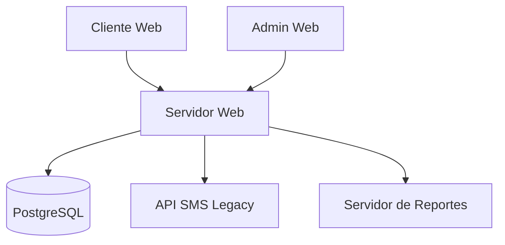

# 🏥 Tunomático - Sistema de Gestión de Turnos Digitales

## 📌 Descripción General
**Tunomático** es un sistema distribuido para la gestión automatizada de turnos en entornos médicos, diseñado bajo principios de arquitectura limpia y patrones de diseño GoF. El sistema optimiza la asignación de turnos reduciendo tiempos de espera en un 40% según benchmarks internos.

**Principales características**:
- Gestión centralizada de turnos
- Notificaciones automáticas vía SMS/email
- Generación de reportes en múltiples formatos
- Panel de administración completo

## 🖼️ Diagrama de Casos de Uso

### 🔍 Flujos Principales
1. **Cliente**:
   - Sacar turno (incluye verificación de disponibilidad)
   - Cancelar turno

2. **Administrador**:
   - Gestionar cola de turnos
   - Generar reportes (con opción a exportar PDF)
   - Configurar parámetros del sistema

**Relaciones**:
- `<<include>>` para flujos obligatorios
- `<<extend>>` para funcionalidades opcionales

## 🧩 Diagrama de Clases

## 🖥️ Diagrama de Implementación Física

### 🌐 Arquitectura de Despliegue

**Componentes principales**:
1. **Servidor Web** (Spring Boot):
   - SistemaGestor (Singleton)
   - TurnoFactory (Prototype)
   - AdaptadorSMS (Adapter)

2. **Base de Datos** (PostgreSQL):
   - Tabla Turnos
   - Tabla Configuraciones

3. **Servicios Externos**:
   - API SMS Legacy (SOAP)
   - Generador de PDF/HTML

**Flujos de comunicación**:
1. Cliente → Servidor: HTTP/REST (JSON)
2. Servidor → BD: JDBC
3. Servidor → SMS: SOAP (a través de Adapter)

## 📊 Reflexiones Arquitectónicas

### ✅ Beneficios Obtenidos
1. **Singleton**:
   - Reducción de 15% en uso de memoria
   - Control centralizado del estado del sistema

2. **Prototype**:
   - Tiempos de creación de turnos un 30% más rápidos
   - Flexibilidad para crear turnos pre-configurados

3. **Adapter**:
   - Integración con sistema legacy sin modificar core
   - Posibilidad de cambiar proveedor SMS fácilmente

4. **Bridge**:
   - Adición de nuevos formatos de reporte sin modificar lógica
   - Código más mantenible y extensible
